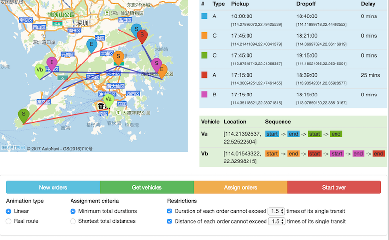
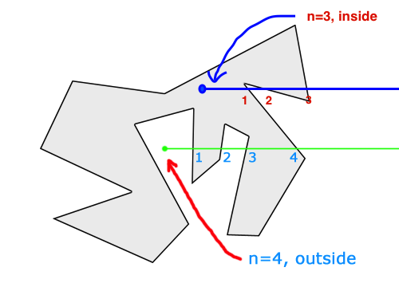

## Carpool prototype

### 1. Introduction

#### 1.1 Steps to run

To run the program, follow the steps below:

1. First you need to create random orders and vehicles. Simply click `New orders` and `Get vehicle `. You will see some new spots showing on the map. Each order has an unique color. Label S(start) and E(end) represent pickup& deliver locations respectively. You will also see two lightgreen spots labeled Va and Vb representing two different vehicles.

2. Then there will be more options showing up, and the button `Assign orders` should be available to click. For the first time you can just leave the options as default and click `Assign orders`.

3. You will see the animation starts, representing each vehicle's path. Related information will also display in the table on the right side.

4. Once animation stopped, you could re-play the animation by clicking 'Assign orders', try other orders&vehicles combinations by clicking `New orders`/`Get vehicles`, or just click `Start over` button to clear the map.

*Options:*

* `Animation type`: The linear one could better illustrate path's order&relationships. But in case you feel it is unreal, just select 'real route'.
* `Assign criteria`: The definition of the best strategy.
* `Restrictions`:  Limitations when calculating the path, considering user's experiences. e.g. if set duration restriction=1.2, and an order takes 10 minutes on single transit, then the order in carpool transit cannot exceed 12 minutes.




#### 1.2 Assign Strategy

The basic idea is:

1. Firstly find all possible ways of partitioning given orders(<=5) into two subsets.

2. For each possible subset of orders, find all possible sequences of location points(vehicle locations, pickup locations& delivery locations).

3. Get the best sequence of them based on certain criterias(shortest distance/duration) and restrictions. Then for each possible partitioning, it has a best solution: two best sequences for the two vehicles.

4. At last we comepare all partitionings, and get the best one based on the criterias.

---

### 2. Algotithm Explainations

#### 2.1 Creating random orders

The key is making sure the random locations are on the land rather than ocean. Mathematically it is equivalent to the question: determine if a point is inside/outside a polygon.

I use RayCasting method: cast a ray from the point, count the num of intersections of the ray and polygon's borders. If num is odd, it's inside; if num is even, it's outside.

See code implementation in [app/Library/Location.php:createRandomAccessibleLocation](https://github.com/Chenimal/carpool/blob/master/app/Library/Location.php#L19).


#### 2.2 Split orders

* **2.2.1** The problem of spliting n orders into two subsets is equivalent to putting n balls into two boxes.

    Code implementation: [app/bootstrap/functions.php:math_combination](https://github.com/Chenimal/carpool/blob/master/bootstrap/functions.php#L10)
```PHP
function math_combination($arr, $num)
{
    if ($num == 0) {
        return [[]];
    }
    $cnt    = count($arr);
    $result = [];
    for ($i = 0; $i < $cnt; $i++) {
        $subs = math_combination(array_slice($arr, $i + 1), $num - 1);
        foreach ($subs as $s) {
            $result[] = array_merge([$arr[$i]], $s);
        }
    }
    return $result;
}
```

* **2.2.2** Note each box could contain up to 3 balls. If n > 3(n=4,5), each box must contain at least n-3 balls.

    Number of combinations:

    - n=1: C<sub>1</sub><sup>0</sup> + C<sub>1</sub><sup>1</sup> = 2
    - n=2: C<sub>2</sub><sup>0</sup> + C<sub>2</sub><sup>1</sup> + C<sub>2</sub><sup>2</sup> = 4
    - n=3: C<sub>3</sub><sup>0</sup> + C<sub>3</sub><sup>1</sup> + C<sub>3</sub><sup>2</sup> + C<sub>3</sub><sup>3</sup>= 8
    - n=4: C<sub>4</sub><sup>1</sup> + C<sub>4</sub><sup>2</sup> + C<sub>4</sub><sup>3</sup>= 14
    - n=5: C<sub>5</sub><sup>2</sup> + C<sub>5</sub><sup>3</sup> = 20

    Thus it has:

    

    Code implementation: [app/Library/Strategy.php:splits](https://github.com/Chenimal/carpool/blob/master/app/Library/Strategy.php#L215)
```PHP
protected static function splits($order_ids)
{
    // maximum&minimum number of orders a vehicle could have at a time
    $max_num_orders = min(3, count($order_ids));
    $min_num_orders = max(0, count($order_ids) - $max_num_orders);

    $splits = [];
    for ($i = $min_num_orders; $i <= $max_num_orders; $i++) {
        $splits_vehicle_a = math_combination($order_ids, $i);
        foreach ($splits_vehicle_a as $combination_a) {
            $splits[] = [$combination_a, array_diff($order_ids, $combination_a)];
        }
    }
    return $splits;
}
```

#### 2.3 To find all sequences

Given n orders, find all sequences of pickup&dropoff locations. Note for each order, the pickup location cannot after its dropoff location. Thus it has **P<sub>2n</sub><sup>2n</sup>/(2<sup>n</sup>)** permutations.

Code implementation: [app/bootstrap/functions.php:math_sequence](https://github.com/Chenimal/carpool/blob/master/bootstrap/functions.php#L33)
```PHP
function math_sequence($arr)
{
    if (count($arr) == 0) {
        return [[]];
    }
    $result = [];
    foreach ($arr as $key => $pair) {
        $select_point = array_shift($pair);

        $rest_arr = array_except($arr, $key);
        $rest_arr = empty($pair) ? $rest_arr : array_merge($rest_arr, [$pair]);

        $sub_sequences = math_sequence($rest_arr);
        foreach ($sub_sequences as $sub) {
            array_unshift($sub, $select_point);
            $result[] = $sub;
        }
    }
    return $result;
}
```

#### 2.4 To find best sequence

First get all sub-sections' duration&distance (`app/Library/Strategy.php:subSectionDistances`).
Then calculate all sequences' durations&distances and select least cost one(Consider restriction& criteria).

---

### 3. Testing

- Create random order *(170 ms on average)*:

`phpunit tests/CreateOrderTest.php --filter testSingleRequest`

`phpunit tests/CreateOrderTest.php --filter testMultiRequests`

- Get vehicles *(40 ms on average)*;

`phpunit tests/GetVehiclesTest.php --filter testSingleRequest`

`phpunit tests/GetVehiclesTest.php --filter testMultiRequests`

- Assign orders *(240 ms on average)*;

`phpunit tests/AssignOrdersTest.php --filter testBorder`

`phpunit tests/AssignOrdersTest.php --filter testSingleRequest`

`phpunit tests/AssignOrdersTest.php --filter testMultiRequests`

---

### 4. Assumptions

- All locations are limited in accessible area in Hong Kong. Some small islands are excluded.
- For each order, the duration(delivery_time - pickup_time) is based on real conditions, not specified by users.
- For each order, the pickup time is flexible and negotiable with clients.
- Each vehicle can take up to 3 orders at a time.
- No more than 5 orders can be shown on the map.

---

### 5. Tech Specs

    * PHP 5.6
    * Lumen 5.4
    * Mysql 5.7
    * Gaode map Api(高德地图)
    * jQuery &Bootstrap
    * Server: Ubuntu 16.x(Ali cloud server)

---

### 6. Log

- 1.0.1 (04.05.2017)

    * Fixed bug: When visiting the demo page at the first time, AMap.UI plugin is loaded incorrectly. Make own icons instead of using UI plugin.
